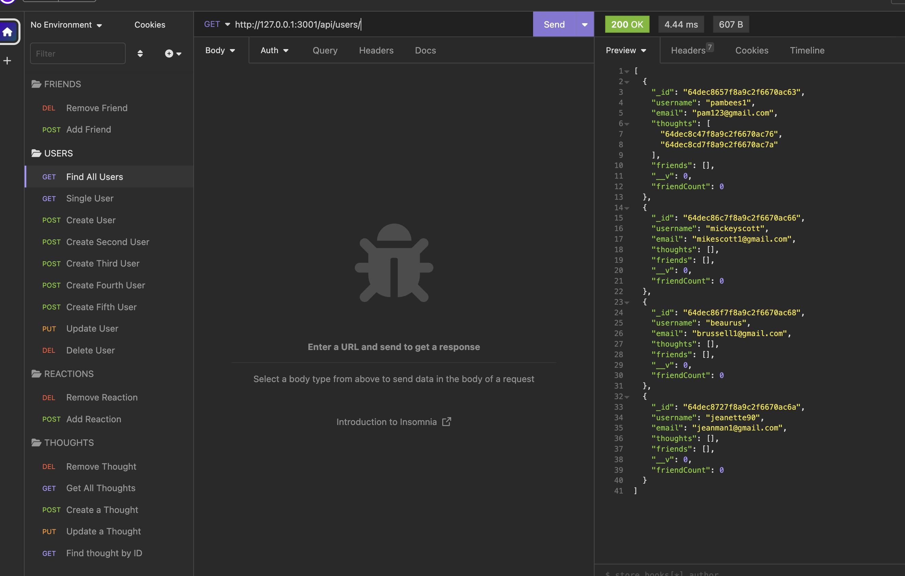

# social_network-api

## Description
This project was created to help a  social media startup create an API for their social network. This social media API uses NoSQL so that the website can handle large amounts of unstructured data. 

## Table of Contents (Optional)
- [Installation](#installation)
- [Usage](#usage)
- [Credits](#credits)
- [License](#license)

## Installation
Install the necessary npm packages and npm install in the integrated terminal. 

## Usage
Open the terminal and run  `node index.js` to start the server. You can confirm that the server is running as the following will display in the terminal: "API server running on port 3001!" The API routes were tested in Insomnia to ensure they were functioning properly. Please refer to the video url below. 

https://drive.google.com/file/d/13bc6XDl0Pg2oKZCkXr_7WORAzqbE9Oyc/view

## Credits
None at this time. 

## License

MIT License

Copyright (c) 2023 Lilibeth Neal 

Permission is hereby granted, free of charge, to any person obtaining a copy
of this software and associated documentation files (the "Software"), to deal
in the Software without restriction, including without limitation the rights
to use, copy, modify, merge, publish, distribute, sublicense, and/or sell
copies of the Software, and to permit persons to whom the Software is
furnished to do so, subject to the following conditions:

The above copyright notice and this permission notice shall be included in all
copies or substantial portions of the Software.

THE SOFTWARE IS PROVIDED "AS IS", WITHOUT WARRANTY OF ANY KIND, EXPRESS OR
IMPLIED, INCLUDING BUT NOT LIMITED TO THE WARRANTIES OF MERCHANTABILITY,
FITNESS FOR A PARTICULAR PURPOSE AND NONINFRINGEMENT. IN NO EVENT SHALL THE
AUTHORS OR COPYRIGHT HOLDERS BE LIABLE FOR ANY CLAIM, DAMAGES OR OTHER
LIABILITY, WHETHER IN AN ACTION OF CONTRACT, TORT OR OTHERWISE, ARISING FROM,
OUT OF OR IN CONNECTION WITH THE SOFTWARE OR THE USE OR OTHER DEALINGS IN THE
SOFTWARE.

